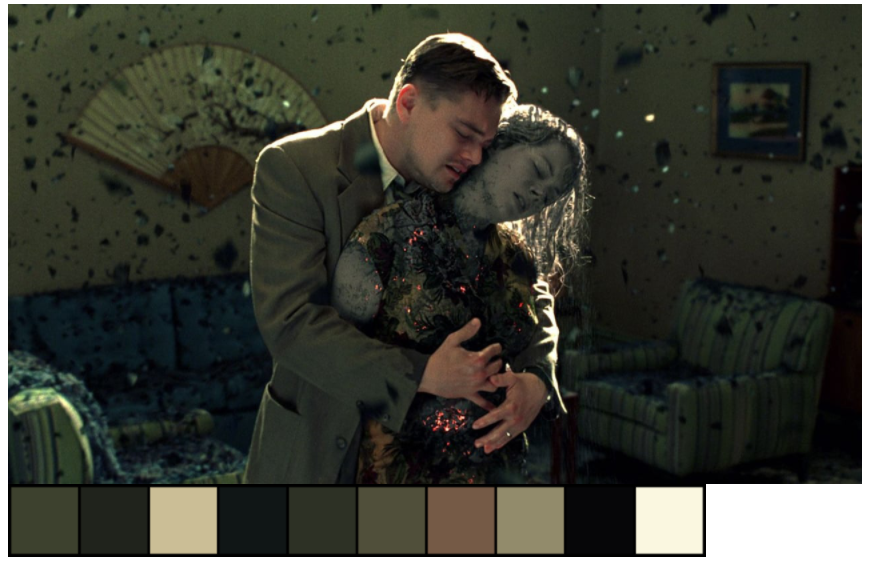

# Color Palette of the Scene

Verilen bir görüntüde kullanılan renk paletini bulabilmek amaçlandı. Bunun için OpenCV ve Sklearn KNN kullanıldı.

**Uygulamayı Google Colab üzerinden yaptım. Bu yüzden *cv2_imshow* kullanılıyor. Masaüstü uygulamasında cv içerisinden imkey ve imshow kullanılmalı.**

Gerekli kütüphaneler

~~~~python

import cv2 as cv
from skimage import io
from google.colab.patches import cv2_imshow
import numpy as np
from sklearn.cluster import KMeans

~~~~

İlk olarak bir görseli almamız gerekiyor. Ben linkler üzerinden de okuma yaptırmak istediğim için skimage kullanıyorum.

~~~~python

image = io.imread("https://www.themoviedb.org/t/p/original/bKCKP0j7Ua9qceKH0TEXRDQ3EVs.jpg")

~~~~

*Eğer bir görseli okurken 404 hatası veriyorsa sitenin okunmasında engel ile karşılaşmıştır. Görseli okutmak için farklı yöntemler denenebilir.*

OpenCV görselleri BGR olarak istiyor. Skimage ise RGB olarak okuyor. Bu yüzden gelene görseli boyutlarından çevirmemiz gerekiyor. Opencv içerisinde fonksiyon var fakat genel liste kuralı ile ters çevirebiliriz.

~~~~python

image = io.imread("https://www.themoviedb.org/t/p/original/bKCKP0j7Ua9qceKH0TEXRDQ3EVs.jpg")[:,:,::-1]

~~~~

K-Nearest Neighbors(KNN) modelini kurmamız gerekiyor. Burada kaç adet küme arayacağını belirlemeliyiz. Bu kümelerin merkezleri bizim renk paletimizdeki renkleri verecek. 10 adet renk yeterli olacaktır.

~~~~python

#KNN Model
n_clusters = 10
model = KMeans(n_clusters=n_clusters,random_state=1).fit(image.reshape(-1,3))

~~~~

Şimdi her bir renk kutusunun genişliğini ve yüksekliğini belirliyoruz.

~~~~python

#Each Color-box Size
height = 100
width = 100

~~~~

Renk kutularını oluşturmamız gerekiyor. Bunun için KNN ile bulunmuş olan küme merkezlerinin içerisinde geziyoruz. Ardından genişliğini, yüksekliğini ve boyutunu belirttiğimiz bir numpy alanını bu kümenin merkezi ile dolduruyoruz. Böylece küme merkezi değeri verilen alanı doldurana kadar tekrar edilecek. Sonrasında renklerin daha iyi görülmesi için kenarlarına siyah çerçeve ekliyoruz. Her bir rengi bir kümeye atıyoruz.

~~~~python

#Create Color Boxes
color_palette = []
for i in model.cluster_centers_: 
  img = np.full((height, width, 3), i, np.uint8)   #create color box and fill with center
  img = cv.copyMakeBorder(img,5,5,2,2,cv.BORDER_CONSTANT,value=[0,0,0])   #add black border
  color_palette.append(img)

~~~~

Oluşturulan renk kutularını yan yana tek bir görselde birleştiriyoruz. İlk ve son değerin kenarlıkları yeterli olmayacak çünkü iç değerler sağdan soldan tekrar etti ve daha kalın oldular. Bu yüzden son olarak onlara kenarlık ekliyoruz.

~~~~python

#Create Color Palette
palette = color_palette[0]
for i in color_palette[1:]:
  palette = np.concatenate((palette,i),axis=1)
palette = cv.copyMakeBorder(palette,0,0,3,3,cv.BORDER_CONSTANT,value=[0,0,0])

~~~~

Son olarak görseli ve paleti ekrana veriyoruz.

~~~~python

#Show
cv2_imshow(image)
cv2_imshow(palette)

~~~~

